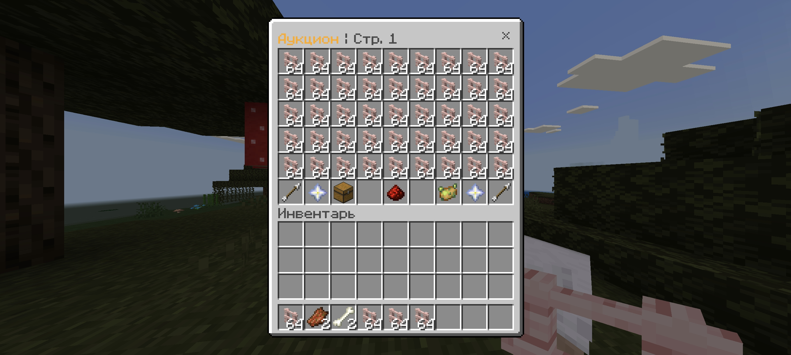
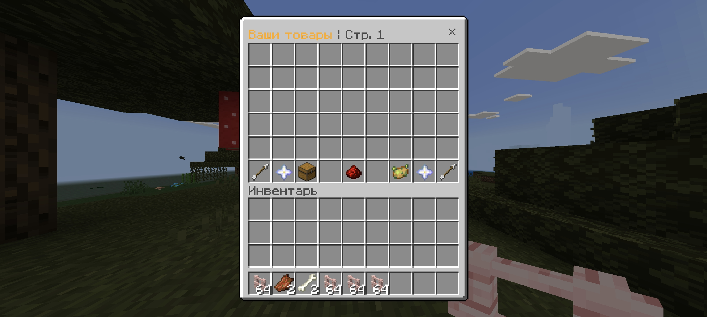
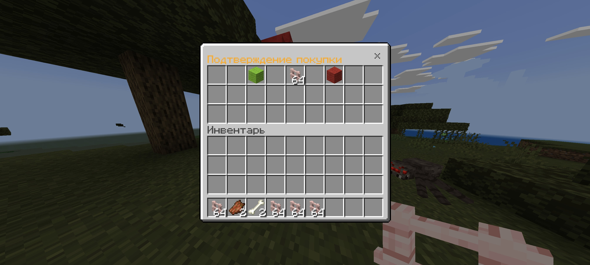

  

# 💫 AstraAuction β
**[Lumi](https://github.com/koshakminedev/lumi) 向けのマーケット（オークション）プラグイン。**

**[EN](README.md)** | **[RU](README_ru.md)** | **[UA](README_ua.md)** | **JA** | **[ZH](README_zh.md)**

## 概要 📖
AstraAuction は [Lumi](https://github.com/koshakminedev/lumi) 向けのプレイヤー間マーケットプラグインです。
アイテムの NBT を完全保持し、データはデータベースに保存、検索・並べ替え・出品管理ができる使いやすい GUI を提供します。

## 特徴 🌟
- **NBT 保持** — 出品者が所持していた状態のまま販売されます。
- **非同期データベース** — すべてのクエリをバックグラウンドで実行し、メインスレッドをブロックしません。
- **取引手数料** — 税率を設定できます。
- **返却保管（claims）** — 未売却ロットやオフライン出品者への支払いを期限まで保管します。
- **GUI マーケット** — 購入、確認ダイアログ、ページ移動。
- **並べ替えと検索** — 価格での並べ替え、名前検索。
- **出品管理** — 自分のロットの閲覧・キャンセルを GUI で操作。
- **柔軟な DB 対応** — SQLite / MySQL / PostgreSQL。
- **ローカライズ** — `ru` *(русский)*、`en` *(English)*、`ua` *(українська)*、`ja` *(日本語)*、`zh` *(中文)* を標準搭載。独自言語の追加も可能。

## スクリーンショット 🖼️
| **マーケットメインページ** | **「自分のロット」ページ** |
|---|---|
|  |  |

| **返却保管ページ** | **購入確認ページ** |
|---|---|
|  |  |

## コマンド ♿
| **コマンド** | **説明** | **権限** |
|---|---|---|
| `/ah` | マーケットを開く | `astraauction.use` |
| `/ah open,gui [page: int]` | 指定ページでマーケットを開く | `astraauction.use` |
| `/ah sell <price: int>` | 手に持っているアイテムを出品 | `astraauction.use` |
| `/ah view <nickname: str> [page: int]` | 指定プレイヤーのロットを見る | `astraauction.use` |
| `/ah search <query: str> [page: int]` | 名前でロット検索 | `astraauction.use` |
| `/ah force_buy <id: int>` | ロットを強制購入（通常購入と同じ処理） | `astraauction.force` |
| `/ah force_expire <id: int>` | ロットを強制終了 | `astraauction.force` |

**コマンドエイリアス:** `/auction`, `/auc`.

## 権限 🔐
- `astraauction.use` — 基本コマンドへのアクセス（既定で全員に付与）。
- `astraauction.force` — 強制コマンドへのアクセス（既定で OP のみ）。

## 設定 ⚙️
主要設定ファイル: [config.yml](src/main/resources/config.yml)

| パラメータ | 説明 | デフォルト |
|---|---|---|
| `database.type` | DB タイプ: `sqlite` / `mysql` / `postgres` | `sqlite` |
| `language` | メッセージ言語 | `en` |
| `auction.duration-seconds` | ロット有効時間（秒） | `172800` (48h) |
| `auction.tax-percent` | 取引手数料（%） | `10.0` |
| `auction.max-slots` | 同時出品数の上限（0 = 無制限） | `6` |
| `auction.claim-expire-seconds` | 保管期限（秒） | `604800` (7d) |
| `auction.gui.page-size` | GUI ページサイズ（最大 45） | `45` |
| `auction.gui.sort-default` | 既定の並べ替え | `price_asc` |

## 依存関係 🔌
- **[EconomyAPI](https://cloudburstmc.org/resources/economyapi.14/)** — 購入と支払いに必須。
- **[FakeInventories](https://github.com/LuminiaDev/FakeInventories)** — GUI 用に必須。
- **[JOOQConnector](https://github.com/MEFRREEX/JOOQConnector)** — JOOQ ORM によるデータベース対応。
- **[Polyglot](https://github.com/DensyDev/Polyglot)** — 動的言語読み込みのローカライズエンジン（シェード済み）。

## ソースからビルド 🔨
1. **[JDK 21+](https://www.google.com/search?q=jdk+21)** をインストール。
2. [リポジトリをクローン](https://www.google.com/search?q=how+to+clone+git+repository)してプロジェクトを開きます。
3. ビルドコマンドを実行: `./gradlew build`
4. 生成された JAR は `build/libs` にあります。

### ビルドに関する注意 ⚠️
このリポジトリには `build.gradle` が 2 つあります:
1 つは本体（`jitpack.io` の代替リポジトリを使用）、もう 1 つは `.old` 付き（Lumi の公式リポジトリ使用）。

Lumi のリポジトリが一時的に利用不可（例: HTTP 500）でビルドに失敗する場合は、現在の `build.gradle` をそのまま使用してください。
または、Lumi の公式リポジトリを使用する場合は、現在の `build.gradle` を削除（または移動）し、`build.gradle.old` の `.old` を外してください。
